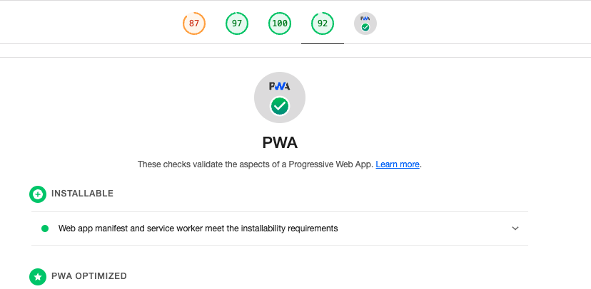

# Svelte + Vite + PWA

## Installation

Install Vite with Svelte template:

```bash
npm create vite@latest vite-svelte-pwa -- --template svelte
cd vite-svelte-pwa
pnpm i
```


## Create the following files and update accoring to your repo

  - service-worker.js
  - manifest.webmanifest
  - icons
  - maskable icon
  - CNAME file for GitHub Pages

## Install gh-pages

```bash
pnpm i -D gh-pages
```

## Update package.json scripts

```json
 "scripts": {
    "dev": "vite",
    "build": "vite build && cp service-worker.js CNAME ./dist ",
    "preview": "vite preview",
    "deploy": "npx gh-pages -d dist"
  },
```

## Update vite.config.js

```js
import { defineConfig } from 'vite'
import { svelte } from '@sveltejs/vite-plugin-svelte'

// https://vitejs.dev/config/
export default defineConfig({
  plugins: [svelte()],
  build: {
    assetsInlineLimit: 0, // 0 means all files will be inlined
  },
})
```

## Run command

```bash
npm run build && npm run deploy
```

## Check the site with Lighthouse

